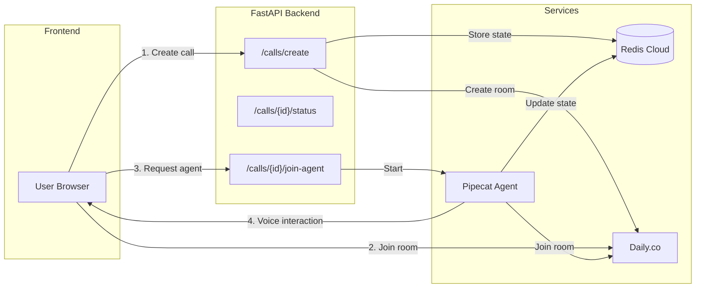

# Voice Backend API Documentation

> **For teammates** - Complete guide to endpoints, data flow, and architecture.

---

## Quick Start

```bash
# Start the server
uvicorn app.main:app --reload --port 8000

# API docs
open http://localhost:8000/docs
```

---

## Architecture Overview



---

## API Endpoints

### `POST /calls/create`

Creates a new voice call room.

**Request:**
```json
{
  "room_name": "optional-custom-name",
  "expires_in_minutes": 60
}
```

**Response:**
```json
{
  "call_id": "uuid",
  "room_name": "generated-room-name",
  "room_url": "https://cloud-xxx.daily.co/room-name",
  "user_token": "jwt-token-for-user",
  "status": "pending"
}
```

**What happens:**
1. Creates Daily.co room via REST API
2. Generates user meeting token
3. Stores call state in Redis with `status: pending`
4. Returns room URL for frontend to join

---

### `GET /calls/{call_id}/status`

Get current call status from Redis.

**Response:**
```json
{
  "call_id": "uuid",
  "status": "pending | active | completed",
  "room_name": "room-name",
  "participants": 0
}
```

---

### `POST /calls/{call_id}/join-agent`

Triggers the AI voice agent to join the call.

**Response:**
```json
{
  "success": true,
  "message": "Agent is joining the call"
}
```

**What happens:**
1. Generates bot meeting token
2. Starts Pipecat agent in background
3. Agent joins Daily room via DailyTransport
4. Registers event handlers for presence detection

---

### `GET /health`

Health check endpoint.

**Response:**
```json
{
  "status": "healthy",
  "service": "voice-interaction-backend"
}
```

---

## Data Flow

### 1. Call Creation Flow

```
Frontend                    Backend                     External
   |                           |                           |
   |-- POST /calls/create ---->|                           |
   |                           |-- Create Room ----------->| Daily.co
   |                           |<-- Room URL + Name -------|
   |                           |                           |
   |                           |-- SET call:{id} --------->| Redis
   |                           |   {status: "pending"}     |
   |                           |                           |
   |<-- room_url, token -------|                           |
   |                           |                           |
   |-- Join room (WebRTC) ---------------------------->| Daily.co
```

### 2. Agent Join Flow

```
Frontend                    Backend                     External
   |                           |                           |
   |-- POST /join-agent ------>|                           |
   |                           |-- Start Pipecat Agent --->|
   |                           |                           |
   |<-- success: true ---------|                           |
   |                           |                           |
   |                    [Pipecat Agent]                    |
   |                           |-- Join Room ------------->| Daily.co
   |                           |                           |
   |                           |<-- on_participant_joined -|
   |                           |                           |
   |                           |-- SET call:{id} --------->| Redis
   |                           |   {status: "active"}      |
```

### 3. Voice Interaction Flow

```
User (in Daily room)        Pipecat Agent              Services
   |                           |                           |
   |-- Speak (audio) --------->|                           |
   |                           |-- Transcription --------->| Daily.co
   |                           |<-- Text ------------------|
   |                           |                           |
   |                           |-- LLM Request ----------->| OpenAI
   |                           |   (may call search_context tool)
   |                           |                           |
   |                           |-- Vector Search --------->| Redis
   |                           |<-- Context docs ----------|
   |                           |                           |
   |                           |<-- LLM Response ----------|
   |                           |                           |
   |                           |-- TTS ------------------->| OpenAI
   |                           |<-- Audio ----------------|
   |                           |                           |
   |<-- Audio response --------|                           |
```

---

## Redis Data Schema

### Call State

**Key:** `call:{call_id}`

```json
{
  "call_id": "uuid",
  "room_name": "daily-room-name",
  "room_url": "https://...",
  "status": "pending | active | completed",
  "participants": ["participant-id-1"],
  "agent_joined": true,
  "updated_at": "2024-01-01T00:00:00Z"
}
```

### Call Interactions (Logs)

**Key:** `call:{call_id}:interactions`

```json
[
  {
    "type": "participant_joined",
    "participant_id": "uuid",
    "timestamp": "2024-01-01T00:00:00Z"
  },
  {
    "type": "tool_call",
    "tool": "search_context",
    "query": "user question",
    "timestamp": "2024-01-01T00:00:05Z"
  }
]
```

---

## Environment Variables

| Variable | Description |
|----------|-------------|
| `DAILY_API_KEY` | Daily.co API key for room creation |
| `REDIS_URL` | Redis Cloud connection URL |
| `REDIS_PASSWORD` | Redis Cloud password |
| `OPENAI_API_KEY` | OpenAI API key for LLM & TTS |
| `OPENAI_MODEL` | Model to use (default: gpt-4o) |

---

## File Reference

| File | Purpose |
|------|---------|
| `app/main.py` | FastAPI app, CORS, logging setup |
| `app/api/routes.py` | All API endpoints |
| `app/services/redis_service.py` | Redis connection & state management |
| `app/services/daily_service.py` | Daily.co room/token creation |
| `app/config.py` | Environment variable loading |
| `bot/bot.py` | Pipecat voice agent |
| `bot/handlers/presence.py` | Participant join/leave detection |
| `bot/tools/vector_search.py` | LLM tool for knowledge retrieval |

---

## Status Values

| Status | Meaning |
|--------|---------|
| `pending` | Call created, waiting for participants |
| `active` | Human participant has joined |
| `waiting` | All humans left, agent still connected |
| `completed` | Call ended |
